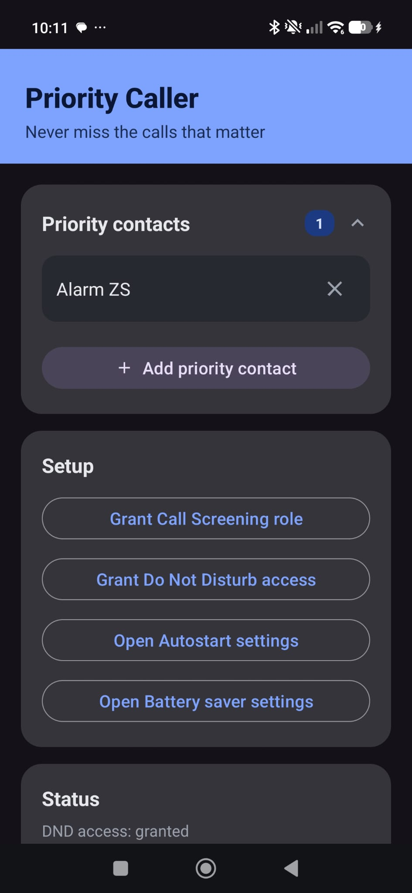

# Priority Caller

An Android app that rings loudly and bypasses Do Not Disturb when one of your
chosen priority contacts calls — using Android's `CallScreeningService` to detect
the call and an alarm-stream ringtone to make sure it's heard.



## Requirements

- Android 8.0 (API 26) or newer
- A phone with a working default dialer/Telecom stack (some custom ROMs disable it)

## Installing on an Android device

### Option A — Run from Android Studio (recommended while developing)

1. Clone this repo and open it in Android Studio.
2. On the phone: **Settings → About phone → tap "Build number" 7 times** to enable
   Developer options, then **Settings → Developer options → USB debugging → on**.
3. Connect the phone via USB and accept the "Allow USB debugging" prompt.
4. Select the phone as the run target and click **Run ▶**.

### Option B — Build and sideload an APK manually

1. From the project root:
   ```
   ./gradlew assembleDebug
   ```
   The APK is written to `app/build/outputs/apk/debug/app-debug.apk`.
2. Install it with adb:
   ```
   adb install -r app/build/outputs/apk/debug/app-debug.apk
   ```
   — or copy the APK to the phone and tap it in a file manager. The phone will
   prompt to allow installs from that source ("Install unknown apps") the first time.

### Option C — Play Store

Not yet published — see the Play Store section of this repo (`docs/PLAY_STORE_LISTING.md`)
for the publishing plan.

## First-run setup (in the app)

After installing, open the app and complete the steps it shows, in order:

1. **Add priority contact(s)** — tap "+ Add priority contact" and pick from your
   address book. Repeat for as many contacts as you want.
2. **Grant the Call Screening role** — required so Android routes every incoming
   call through this app to check it against your priority list.
3. **Grant Do Not Disturb access** — required so the priority ringtone can sound
   even while DND is on.
4. **(Xiaomi/MIUI devices only)** Open Autostart settings and enable the app, then
   open Battery saver settings and set it to "No restrictions" — MIUI aggressively
   kills background services otherwise.

Once set up, leave the app installed (it doesn't need to stay open) — the system
calls it in the background for every incoming call.

### Optional: custom ringtone

Drop an MP3 at `app/src/main/res/raw/priority_ringtone.mp3` before building to use
your own sound. If that file isn't present, the app falls back to the device's
default ringtone, still played at alarm volume so it isn't silenced by DND.

## Uninstalling

A normal uninstall removes the app and all locally stored priority contacts —
nothing is stored anywhere else.

## License

Apache License 2.0 — see [LICENSE](LICENSE).
