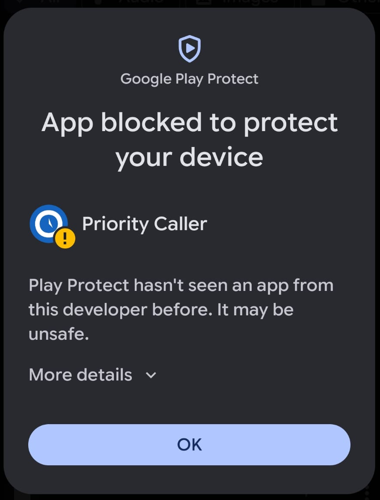
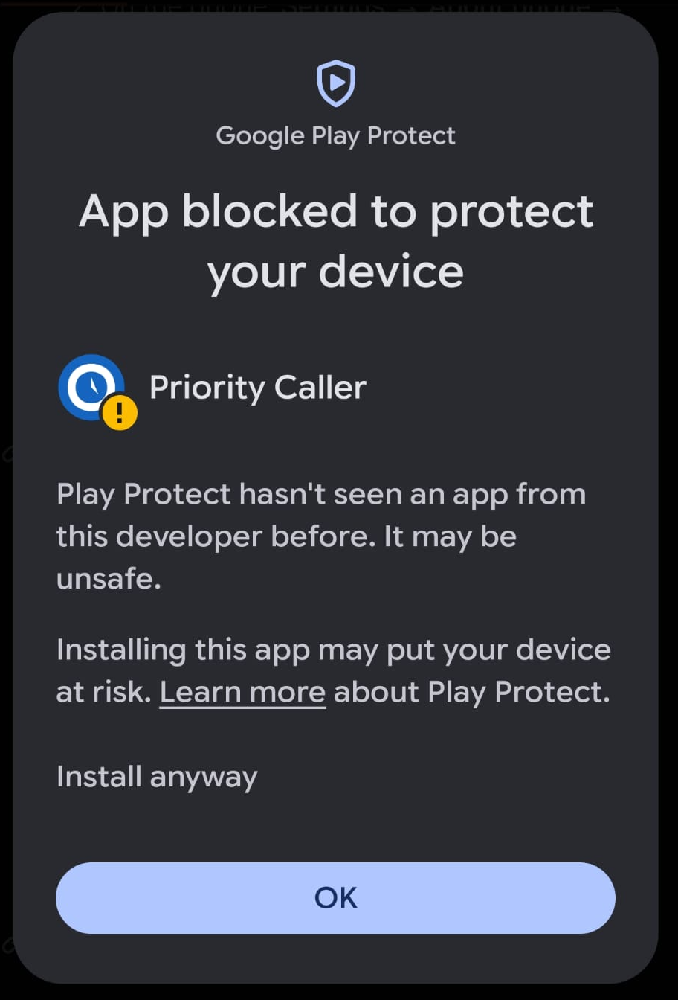

# Priority Caller

An Android app that rings loudly and bypasses Do Not Disturb when one of your
chosen priority contacts calls — using Android's `CallScreeningService` to detect
the call and an alarm-stream ringtone to make sure it's heard.

 

## Requirements

- Android 8.0 (API 26) or newer
- A phone with a working default dialer/Telecom stack (some custom ROMs disable it)

## Installing on an Android device

### Run from Android Studio (recommended while developing)

1. Clone this repo and open it in Android Studio.
2. On the phone: **Settings → About phone → tap "Build number" 7 times** to enable
   Developer options, then **Settings → Developer options → USB debugging → on**.
3. Connect the phone via USB and accept the "Allow USB debugging" prompt.
4. Select the phone as the run target and click **Run ▶**.

### Download apk from Releases and install directly on the Mobile Device

1. Download APK from github Release (e.g.: [GitHub Release][ReleaseLink]).
2. The first time you install an APK downloaded through the browser, Android blocks
   it until you allow that browser specifically to install unknown apps: when
   prompted, tap **Settings** on the warning, then enable **Allow from this source**
   for your browser (or go to **Settings → Apps → [your browser] → Install unknown
   apps → Allow from this source** beforehand).
3. Tap `app-release.apk` in your Downloads folder.
4. When Running a Samsung Device you might need to disable the `Auto Blocker`.
    > Go to Settings > Security and privacy > Auto Blocker and toggle the switch
5. When the blue/gray Google Play Protect warning pops up, do not click OK. Click `More details`.  

6. Tap the small text link that says "Install anyway" directly above the OK button.  

### Download apk from Releases and install using a Computer

1. Download APK from github Release (e.g.: [GitHub Release][ReleaseLink]).
2. Connect the Phone to your Computer and enable Debugging as described above.
3. Install adb ( [Android Debug Bridge](https://developer.android.com/tools/adb)).
4. Check if Device is available `adb devices`.
5. Open Download location in Terminal and run `adb install -r app-release.apk`.

## First-run setup (in the app)

After installing, open the app and complete the steps it shows, in order:

1. **Add priority contact(s)** — tap "+ Add priority contact" and pick from your
   address book. Repeat for as many contacts as you want.
2. **Grant the Call Screening role** — required so Android routes every incoming
   call through this app to check it against your priority list.
3. **Grant Do Not Disturb access** — required so the priority ringtone can sound
   even while DND is on.
4. **(Xiaomi/MIUI devices only)** Open Autostart settings and enable the app, then
   open Battery saver settings and set it to "No restrictions" — MIUI aggressively
   kills background services otherwise.

Once set up, leave the app installed (it doesn't need to stay open) — the system
calls it in the background for every incoming call.

### Enabling/disabling alerts

The switch at the top of the app turns the priority alert on or off without
removing your saved contacts or permissions. While disabled, incoming calls are
left completely untouched — no loud ringtone, no DND bypass — the app just steps
out of the way.

### Optional: custom ringtone

Tap "Choose priority sound" in the app to pick any ringtone on your device — the
ⓘ button next to it shows which one is currently selected, and "Reset" reverts to
the built-in default. Alternatively, drop an MP3 at
`app/src/main/res/raw/priority_ringtone.mp3` before building to bundle your own
sound as that default. If neither a custom pick nor a bundled file is available,
the app falls back to the device's default ringtone — always played at alarm
volume so it isn't silenced by DND.

## Uninstalling

A normal uninstall removes the app and all locally stored priority contacts —
nothing is stored anywhere else.

## Releases

Every push to `main` (including a merged PR) triggers an automated build that
publishes a new [GitHub Release][ReleasesPage] with a signed `app-release.apk`
attached. The version number bumps automatically based on your commit messages
since the last release, following [Conventional Commits][ConventionalCommits]:

- `fix: ...` → patch bump (`1.2.3` → `1.2.4`)
- `feat: ...` → minor bump (`1.2.3` → `1.3.0`)
- `feat!: ...` or a `BREAKING CHANGE:` footer → major bump (`1.2.3` → `2.0.0`)
- anything else still bumps the patch version

Pull requests run a separate build + lint check and never publish a release.

## License

Apache License 2.0 — see [LICENSE](LICENSE).

[ReleaseLink]: https://github.com/tribock/android-priority-caller/releases/download/v0.0.5/app-release.apk
[ReleasesPage]: https://github.com/tribock/android-priority-caller/releases
[ConventionalCommits]: https://www.conventionalcommits.org/